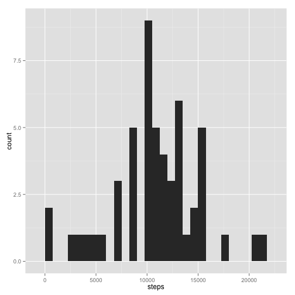
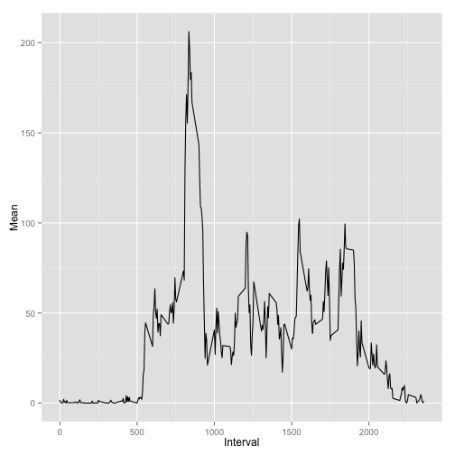
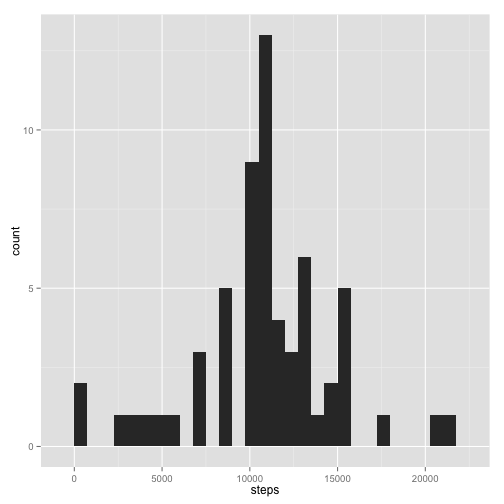
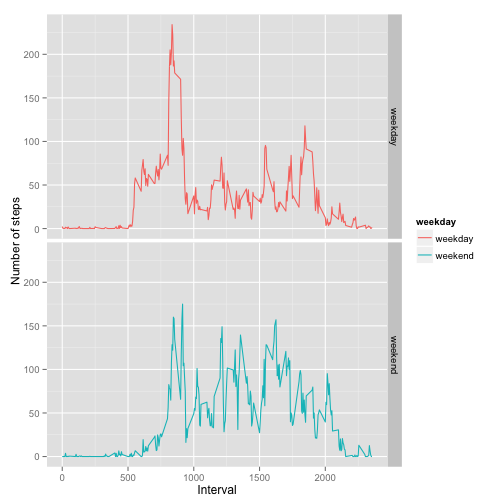

# Reproducible Research: Peer Assignment 1
### Jaimon Jose
**_19 July 2014_**

It is now possible to collect a large amount of data about personal movement using activity monitoring devices such as a [Fitbit][1], [Nike Fuelband][2], or [Jawbone Up][3]. These type of devices are part of the "quantified self" movement -- a group of enthusiasts who take measurements about themselves regularly to improve their health, to find patterns in their behavior, or because they are tech geeks. But these data remain under-utilized both because the raw data are hard to obtain and there is a lack of statistical methods and software for processing and interpreting the data.

This assignment makes use of data from a personal activity monitoring device. This device collects data at 5 minute intervals through out the day. The data consists of two months of data from an anonymous individual collected during the months of October and November, 2012 and include the number of steps taken in 5 minute intervals each day.

## Loading and preprocessing data

```r
activity.df <- read.csv("activity.csv")
# Convert column date to type "date"
activity.df <- transform(activity.df, date = as.Date(date))
```

What is the percentage of NA in the dataset?

```r
mean(is.na(activity.df$steps))
```

```
## [1] 0.1311
```

Summarize the data.

```
##      steps            date               interval   
##  Min.   :  0.0   Min.   :2012-10-01   Min.   :   0  
##  1st Qu.:  0.0   1st Qu.:2012-10-16   1st Qu.: 589  
##  Median :  0.0   Median :2012-10-31   Median :1178  
##  Mean   : 37.4   Mean   :2012-10-31   Mean   :1178  
##  3rd Qu.: 12.0   3rd Qu.:2012-11-15   3rd Qu.:1766  
##  Max.   :806.0   Max.   :2012-11-30   Max.   :2355  
##  NA's   :2304
```

## What is mean total number of steps taken per day?
To compute the total number of steps taken per day, summarize the data daywise first.

```r
daywise.df <- aggregate(steps ~ date, data = activity.df, sum)
head(daywise.df)
```

```
##         date steps
## 1 2012-10-02   126
## 2 2012-10-03 11352
## 3 2012-10-04 12116
## 4 2012-10-05 13294
## 5 2012-10-06 15420
## 6 2012-10-07 11015
```

```r
# Draw a histogram that shows total number of steps taken each day
library("ggplot2")
ggplot(daywise.df, aes(x=steps)) + geom_histogram(binwidth=750)
```

 

```r
# Compute the mean and median total number of steps taken.
# Community TA suggested in the forum that the actual intent is to 
# calculate and report the mean and median of total number of steps 
# taken per day
library("plyr")
ddply(daywise.df, .(date), summarize, Mean = round(mean(steps, na.rm=TRUE), 2), Median = median(steps, na.rm=TRUE))
```

```
##          date  Mean Median
## 1  2012-10-02   126    126
## 2  2012-10-03 11352  11352
## 3  2012-10-04 12116  12116
## 4  2012-10-05 13294  13294
## 5  2012-10-06 15420  15420
## 6  2012-10-07 11015  11015
## 7  2012-10-09 12811  12811
## 8  2012-10-10  9900   9900
## 9  2012-10-11 10304  10304
## 10 2012-10-12 17382  17382
## 11 2012-10-13 12426  12426
## 12 2012-10-14 15098  15098
## 13 2012-10-15 10139  10139
## 14 2012-10-16 15084  15084
## 15 2012-10-17 13452  13452
## 16 2012-10-18 10056  10056
## 17 2012-10-19 11829  11829
## 18 2012-10-20 10395  10395
## 19 2012-10-21  8821   8821
## 20 2012-10-22 13460  13460
## 21 2012-10-23  8918   8918
## 22 2012-10-24  8355   8355
## 23 2012-10-25  2492   2492
## 24 2012-10-26  6778   6778
## 25 2012-10-27 10119  10119
## 26 2012-10-28 11458  11458
## 27 2012-10-29  5018   5018
## 28 2012-10-30  9819   9819
## 29 2012-10-31 15414  15414
## 30 2012-11-02 10600  10600
## 31 2012-11-03 10571  10571
## 32 2012-11-05 10439  10439
## 33 2012-11-06  8334   8334
## 34 2012-11-07 12883  12883
## 35 2012-11-08  3219   3219
## 36 2012-11-11 12608  12608
## 37 2012-11-12 10765  10765
## 38 2012-11-13  7336   7336
## 39 2012-11-15    41     41
## 40 2012-11-16  5441   5441
## 41 2012-11-17 14339  14339
## 42 2012-11-18 15110  15110
## 43 2012-11-19  8841   8841
## 44 2012-11-20  4472   4472
## 45 2012-11-21 12787  12787
## 46 2012-11-22 20427  20427
## 47 2012-11-23 21194  21194
## 48 2012-11-24 14478  14478
## 49 2012-11-25 11834  11834
## 50 2012-11-26 11162  11162
## 51 2012-11-27 13646  13646
## 52 2012-11-28 10183  10183
## 53 2012-11-29  7047   7047
```


## What is the average daily activity pattern?
Subset the data in a 5 second interval and compute the daily average for each of those intervals.


```r
daily.avg.df <- ddply(activity.df, .(interval), summarize, mean = mean(steps, na.rm=TRUE))
ggplot(daily.avg.df, aes(interval, mean)) + geom_line() + ylab("Mean") + xlab("Interval")
```

 

```r
# Find out the 5-min interval that contains maximum number of steps
head(arrange(daily.avg.df, desc(mean)))
```

```
##   interval  mean
## 1      835 206.2
## 2      840 195.9
## 3      850 183.4
## 4      845 179.6
## 5      830 177.3
## 6      820 171.2
```


Its shown in the above table that 835 is the interval with maximum number of steps

## Imputing missing values
Compute the percentage of NAs in the dataset

```r
# Number of rows with complete data
nrow(activity.df[complete.cases(activity.df), ])
```

```
## [1] 15264
```

```r
# number of rows with missing data
sum(is.na(activity.df))
```

```
## [1] 2304
```

```r
# Impute the data with daily mean
data.imp.df = transform(activity.df, steps = ifelse(is.na(steps), mean(steps, na.rm=TRUE), steps))
data.imp.df <- aggregate(steps ~ date, data = data.imp.df, sum)

# Compute the mean and median of total number of steps taken per day
ddply(data.imp.df, .(date), summarize, Mean = round(mean(steps, na.rm=TRUE), 2), Median = median(steps, na.rm=TRUE))
```

```
##          date  Mean Median
## 1  2012-10-01 10766  10766
## 2  2012-10-02   126    126
## 3  2012-10-03 11352  11352
## 4  2012-10-04 12116  12116
## 5  2012-10-05 13294  13294
## 6  2012-10-06 15420  15420
## 7  2012-10-07 11015  11015
## 8  2012-10-08 10766  10766
## 9  2012-10-09 12811  12811
## 10 2012-10-10  9900   9900
## 11 2012-10-11 10304  10304
## 12 2012-10-12 17382  17382
## 13 2012-10-13 12426  12426
## 14 2012-10-14 15098  15098
## 15 2012-10-15 10139  10139
## 16 2012-10-16 15084  15084
## 17 2012-10-17 13452  13452
## 18 2012-10-18 10056  10056
## 19 2012-10-19 11829  11829
## 20 2012-10-20 10395  10395
## 21 2012-10-21  8821   8821
## 22 2012-10-22 13460  13460
## 23 2012-10-23  8918   8918
## 24 2012-10-24  8355   8355
## 25 2012-10-25  2492   2492
## 26 2012-10-26  6778   6778
## 27 2012-10-27 10119  10119
## 28 2012-10-28 11458  11458
## 29 2012-10-29  5018   5018
## 30 2012-10-30  9819   9819
## 31 2012-10-31 15414  15414
## 32 2012-11-01 10766  10766
## 33 2012-11-02 10600  10600
## 34 2012-11-03 10571  10571
## 35 2012-11-04 10766  10766
## 36 2012-11-05 10439  10439
## 37 2012-11-06  8334   8334
## 38 2012-11-07 12883  12883
## 39 2012-11-08  3219   3219
## 40 2012-11-09 10766  10766
## 41 2012-11-10 10766  10766
## 42 2012-11-11 12608  12608
## 43 2012-11-12 10765  10765
## 44 2012-11-13  7336   7336
## 45 2012-11-14 10766  10766
## 46 2012-11-15    41     41
## 47 2012-11-16  5441   5441
## 48 2012-11-17 14339  14339
## 49 2012-11-18 15110  15110
## 50 2012-11-19  8841   8841
## 51 2012-11-20  4472   4472
## 52 2012-11-21 12787  12787
## 53 2012-11-22 20427  20427
## 54 2012-11-23 21194  21194
## 55 2012-11-24 14478  14478
## 56 2012-11-25 11834  11834
## 57 2012-11-26 11162  11162
## 58 2012-11-27 13646  13646
## 59 2012-11-28 10183  10183
## 60 2012-11-29  7047   7047
## 61 2012-11-30 10766  10766
```

```r
# Histogram of the imputed data
ggplot(data.imp.df, aes(x=steps)) + geom_histogram(binwidth=750)
```

 
The above table shows that there is not much difference between the mean and median of the imputed data from the original except that additional rows are present as there are no NAs in the dataset now

## Are there differences in activity patterns between weekdays and weekends?

```r
# Add a column to indicate the day of the week
weekday.df <- transform(activity.df, weekday = as.factor(weekdays(activity.df$date)))
# Convert the column day of the week to "weekend" or "weekday"
weekday.df <- transform(weekday.df, weekday = as.factor(ifelse(weekday.df$weekday %in% c("Saturday", "Sunday"), "weekend", "weekday"))) 

# Preparation for the plot
weekday.avg.df <- ddply(weekday.df, .(interval, weekday), summarize, mean = mean(steps, na.rm=TRUE))
ggplot(weekday.avg.df, aes(interval, mean)) + geom_line(aes(color=weekday)) + ylab("Number of steps") + xlab("Interval") + facet_grid( weekday ~ .)
```

 


[1]: http://fitbit.com "Fitbit"
[2]: http://www.nike.com/us/en_us/c/nikeplus-fuelband "Nike Fuelband"
[3]: https://jawbone.com/up "A fitter you"
